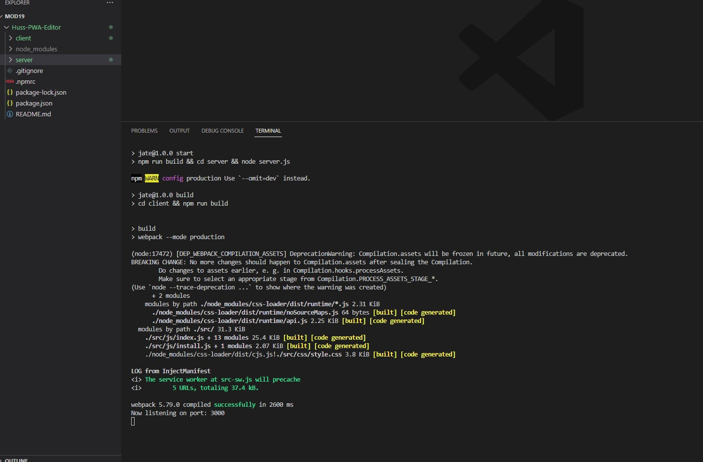
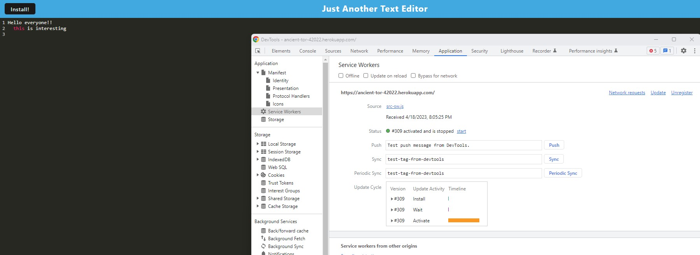
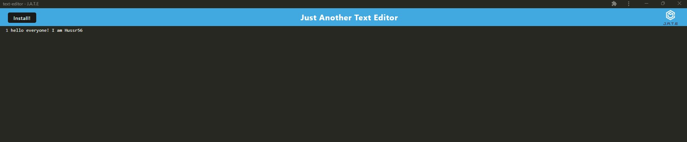
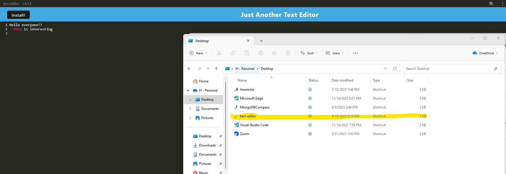
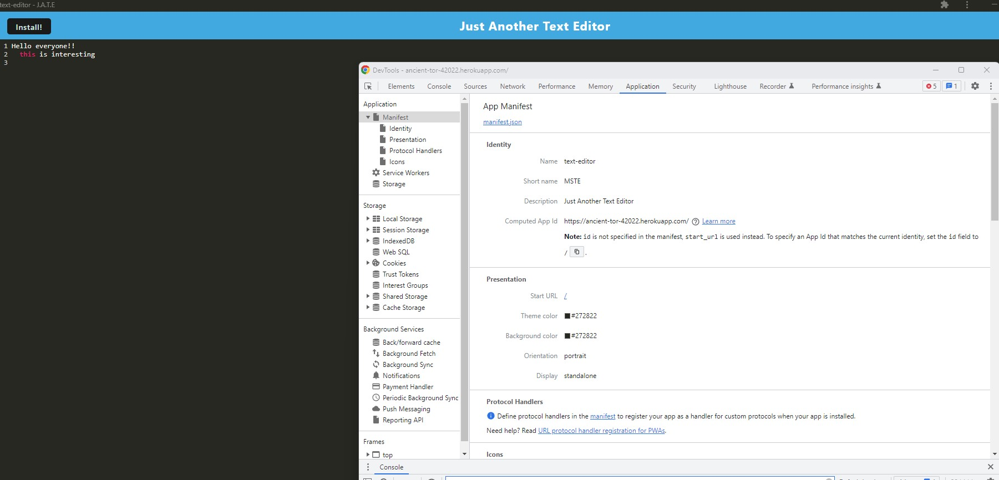
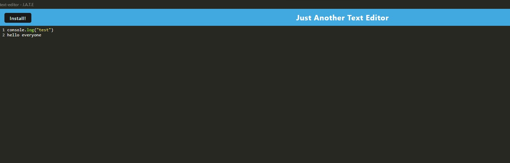
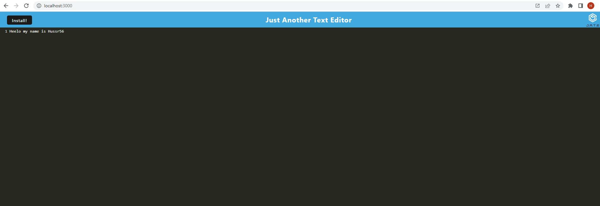
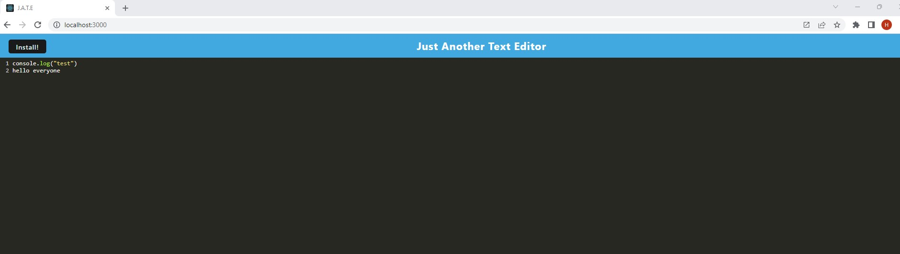
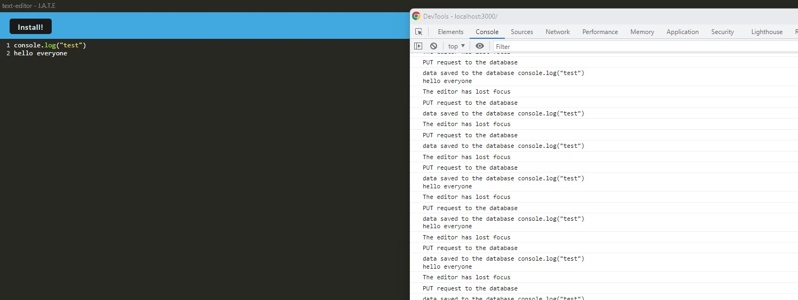

# Huss-PWA-Editor

## Table of Contents: 
* [Description](#description)
* [Actions Taken](#actions-taken)
* [Screen Shot](#screen)
* [Links](#links)

## Description
For this weeks assignment we were to create a single-page text editor that runs in the browser that also includes an installable PWA (Progressive Web Application). It will feature a number of data persistence techniques that serve as redundancy in case one of the options is not supported by the browser; and will also function offline.

## Actions Taken
* Used IndexedDB for for getting and storing data on the database. 
* Used webpack.config to bundle JS files to ensure the application's speed and performance while loading. 
* Used service worker and manifest.json to cache the assets of the website. 
* Used Heroku for full-stack application deployment on a live URL.  

## Screen Shot

 

 

 

 

 

 

 

 

 

 
## Links
* Github Link: https://github.com/hussrizk56/Huss-PWA-Editor

* Live URL: https://ancient-tor-42022.herokuapp.com/

